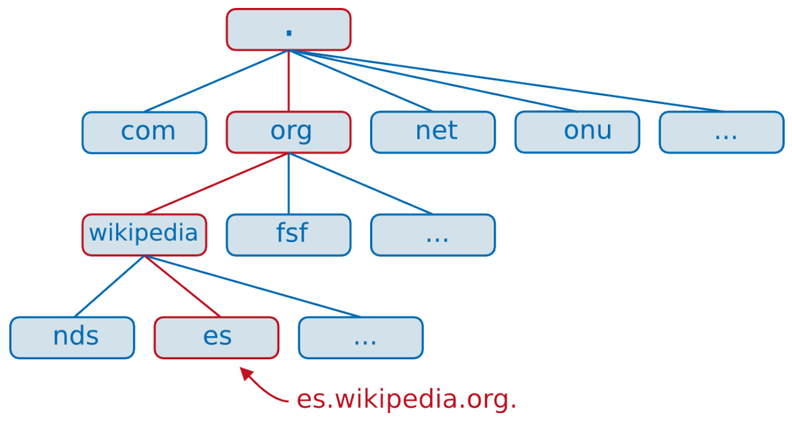
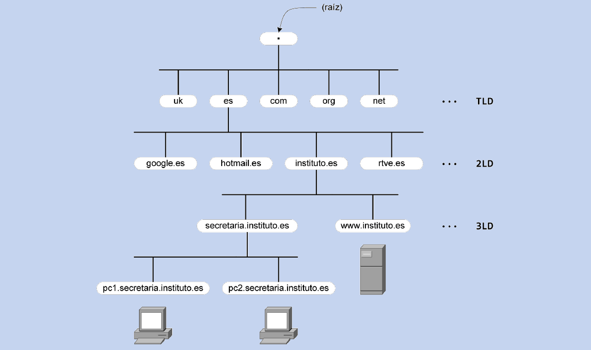
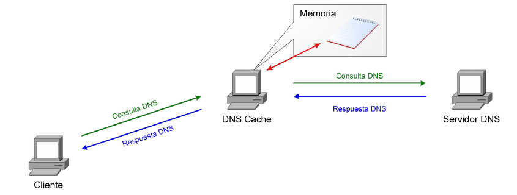
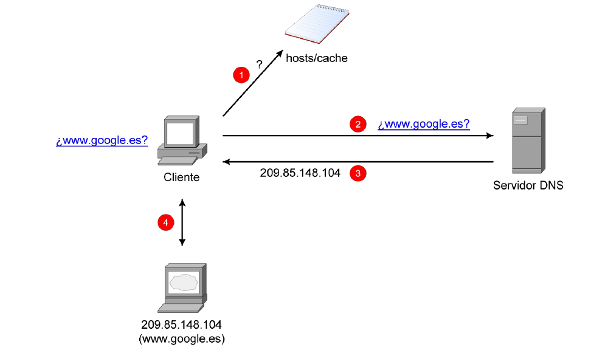

# PARÁMETROS DE RED

- [Diapositivas](http://jamj2000.github.io/despliegueaplicacionesweb/5/diapositivas)
- [Actividades](http://jamj2000.github.io/despliegueaplicacionesweb/5/actividades)

<!---
Ejemplos de inserción de videos

<video class="stretch" controls><source src="http://clips.vorwaerts-gmbh.de/big_buck_bunny.mp4" type="video/mp4"></video>
<iframe width="560" height="315" src="https://www.youtube.com/embed/3RBq-WlL4cU" frameborder="0" allowfullscreen></iframe>

slide: data-background="#ff0000" 
element: class="fragment" data-fragment-index="1"
-->

## Despliegue de aplicaciones web
---

<small> 2018-19 - IES Luis Vélez de Guevara - Écija - Spain </small>


## Parámetros de red

[](http://creativecommons.org/licenses/by-sa/4.0/)


## Índice
--- 
- ### Introducción
- ### DNS: Conceptos
- ### DNS: Tipos de servidores
- ### DNS: Resolución de nombres
- ### DNS: Bind9

<!--- Note: Nota a pie de página. -->


## Introducción


### En esta Unidad aprenderemos a

- Describir la estructura, nomenclatura y funcionalidad de los sistemas de nombres jerárquicos.
- Identificar las necesidades de configuración del servidor de nombres en función de los requerimientos de ejecución de las aplicaciones Web desplegadas.
- Identificar la función, elementos y estructuras lógicas del servicio de directorio.
- Elaborar documentación relativa a las adaptaciones realizadas en los servicios de red.


## DNS: Conceptos


### DNS

- DNS (Domain Name System, sistema de nombres de dominio) 
- Traduce nombres de equipos a direcciones IP y viceversa.
  - Nombre <----> Dirección IP. 
  - P. ej: www.google.es <----> 172.217.17.3

- Hace uso de una **base de datos distribuida** con información sobre equipos (hosts).
- En los inicios de internet la información estaba centralizada.
  - Para ello se utilizaba un archivo **HOST.TXT**.
  - Estaba alojado en el Stanford Research Institute.

- [Archivo hosts](https://es.wikipedia.org/wiki/Archivo_hosts)


### FQDN

- Fully Qualified Host/Domain Name (FQHN/FQDN) "nombre completo" de un equipo. 
- Formado por el **hostname**, seguido de un punto y su correspondiente nombre de **dominio**.
  - Por ejemplo, www.google.es.
  - **www** es el hostname.
  - **google.es** es el dominio.




### Niveles




### Dominios de nivel superior

**gTLD - Generic Top Level Domains**

- Dominios originales. P. ej: **.com**, **.org**, **.net**, ...
- Nuevos dominios. P. ej: **.bar**, **.blog**, **.download**, ...


### Dominios de nivel superior

**sTLD - Sponsored Top Level Domains**

- Dominios patrocinados por determinados colectivos. 
- P. ej: **.cat**,  **.museum**, **.aero**, ...


### Dominios de nivel superior

**ccTLD -Country Code Top Level Domains**

- Dominios asociados a un país.
- P. ej: **.es**, **.fr**, **.cn**, **.io**, ...


### Lista de TLD

- [Lista de TLD en Wikipedia](https://en.wikipedia.org/wiki/List_of_Internet_top-level_domains)
- [Lista actualizada de todos los TLD](https://www.iana.org/domains/root/db)


### Servidores raíz

- También llamados TNS (Top Name Servers).
- Son 13 en total. Pero tienen varias replicas
- Se conocen como A, B, C, D, E, F, G, H, I, J, K, L y M.
- Todos tienen la misma información.
- Se reparten el trabajo de resolución.
- Cada uno es una copia de seguridad del resto.

[Root Servers](http://www.root-servers.org/)


## DNS: Tipos de servidores

- Servidor primario (maestro)
- Servidor secundario (esclavo)
- Servidor caché
- Servidor de reenvío


### Servidor primario (maestro)

- Tiene autoridad sobre una zona.
- Obtiene la información de sus zonas de sus archivos locales.
- Todas las modificaciones sobre una zona se llevan a cabo en el servidor primario.
- No necesita reenviar la consulta.


### Servidor primario (maestro)


### Servidor secundario (esclavo)

- Tiene información (sólo lectura) sobre algunas zonas.
- Estos datos son copias de los servidores maestros.
- Cuando cambia la información en un servidor maestro, el esclavo la copia simplemente para actualizarse.
- Sólo atiende a peticiones de los clientes (resolvedores).


### Servidor secundario (esclavo)


### Servidor caché

- No tiene autoridad sobre ninguna zona.
- En principio (cuando arranca) no es capaz de hacer ninguna resolución por si mismo.
- Cuando recibe una consulta, la reenvía a servidores que puedan resolverla y cuando le responden, almacena la respuesta en memoria.


### Servidor caché




### Servidor de reenvío

- No posee autoridad sobre las zonas que resuelve.
- Cuando reciben una consulta, la reenvían a los servidores que tienen configurados esperando que éstos la resuelvan.


### Servidor de reenvío


## DNS: Resolución de nombres


### Procedimiento




### Tipos de resoluciones

- **Resolución directa**: Nombre --> IP
- **Resolución inversa**: IP --> Nombre


### Utilidades para consultas DNS

- **nslookup**
- **host**
- **dig**


### DIG
#### Ejemplos de uso

**Resolución directa**

```bash
# Consulta registro A
dig  @8.8.8.8  www.google.es

# Consulta cualquier registro
dig  @8.8.8.8  -t ANY   google.es
```

**Resolución inversa**

```bash
# Consulta registro PTR
dig  @8.8.8.8  -x 172.217.17.3
```


## DNS: Bind9

Software usado en los servidores DNS. Versión 9.

**`apt  install  bind9`**


### Gestión del servicio

```bash
systemctl  start   bind9  # service bind9 start
systemctl  restart bind9  # service bind9 restart
systemctl  stop    bind9  # service bind9 stop
systemctl  status  bind9  # service bind9 status

systemctl  enable  bind9  
systemctl  disable bind9  
```


### Configuración
#### Directorios y Archivos

- **`/etc/bind`**: Archivos principales
  - **`named.conf`** : fichero principal.
  - **`named.conf.options`** : opciones genéricas.
  - **`named.conf.local`** : especificación local.
- **`/var/lib/bind`**: Archivos de zonas primarias.
  - **`db.example.com`**: ejemplo de zona directa
  - **`db.172.16`**: ejemplo de zona inversa
- **`/var/cache/bind`**: Archivos de zonas secundarias.


### named.conf.local
#### Ejemplo

```
zone "example.com" {
  type master;
  file "/var/lib/bind/db.example.com";
};

zone "16.172.in-addr.arpa" {
  type master;
  file "/var/lib/bind/db.172.16";
};
```


### named.conf.options
#### Ejemplo

```
    forwarders {
                8.8.8.8;
                8.8.4.4;
         };
```


### Registros de recursos (RR)

- **A** = Address → correspondencia nombre - IPv4
- **AAAA** → correspondencia nombre - IPv6.
- **CNAME** = Canonical name → alias o apodo para nombre.
- **MX** = Mail Exchanger → servidores de correo del dominio.
- **NS** = Name Server → servidores de nombres oficiales del dominio.
- **PTR** = PoinTeR → correspondencia IP - nombre.
- **SOA** = Start Of Authority → autoridad sobre el dominio de nombres.


### db.example.com
#### Ejemplo zona directa

```
$ORIGIN example.com.
$TTL 1d

@          SOA  ns1  admin  (
           1  ; serial
           6h ; refresh
           1h ; retry
           1w ; expire
           6h ; nxdomain
)

           NS ns1
           NS ns2

ns1        A  172.16.0.101
ns2        A  172.16.0.102
pc01       A  172.16.0.201
pc02       A  172.16.0.202
```


### db.172.16
#### Ejemplo zona inversa

```
$ORIGIN 16.172.in-addr.arpa.
$TTL 1d

@          SOA  ns1.example.com.  admin.example.com. (
           1  ; serial
           6h ; refresh
           1h ; retry
           1w ; expire
           6h ; nxdomain
)

           NS ns1.example.com.
           NS ns2.example.com.

101.0      PTR ns1.example.com.
102.0      PTR ns2.example.com.
201.0      PTR pc01.example.com.
202.0      PTR pc02.example.com.
```


### Herramientas de comprobación

```
named-checkconf  -z
named-checkzone  example.com  /var/lib/bind/db.example.com
named-checkzone  16.172.in-addr.arpa  /var/lib/bind/db.172.16
```


